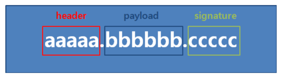
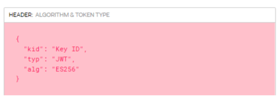
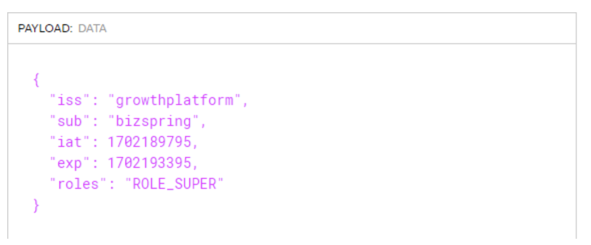
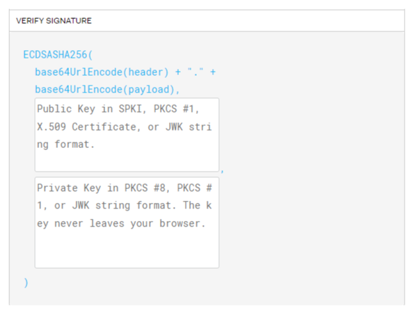

<h1>캡스톤 디자인 GO (가볼까?)</h1>

<h2> JWT</h2>

<h3> Cookie의 단점</h3>

쿠키는 노출이 되었을 때 id, pw에 대한 민감 정보까지 다 노출이 될 가능성이 있음

조작당해서 들어올 가능성이 있음

웹 브라우저마다 쿠키에 대한 지원 형태가 다르기 때문에 브라우저 간의 공유가 불가능함

사이즈가 제한되어있어 원하는 만큼의 충분한 데이터를 담을 수 없는 경우가 있음

유저를 인증하고 식별하기 위한 토큰 (Token)기반 인증

토큰 자체에 사용자의 권한 정보나 서비스를 사용하기 위한 정보가 포함됨

세션을 사용할 경우 쿠키 등을 통해 사용자를 식별하고 서버에 세션을 저장했지만,

토큰을 클라이언트에 저장하고 요청시 HTTP 헤더에 토큰을 첨부하는 것만으로도 단순하게 데이터를 요청하고 응답받을 수 있음

<h3> 1. Header (헤더)</h3>

서명시 사용하는 키(kid), 사용할 타입(typ), 서명 암호화 알고리즘(alg)의 정보가 담겨 있음

<ul>
    <li>kid: 서명 시 사용하는 키를 식벽하는 값</li>
    <li>typ: 토큰 유형</li>
    <li>alg: 서명 암호화 알고리즘 SHA-256</li>
</ul>

<h3> 2. Payload (페이로드)</h3>

토큰에서 사용할 정보의 조각들인 클레임(Claim)이 담겨 있음

클레임은 Key/Value 형태로 된 값을 가짐

저장되는 정보에 따라 등록된 클레임(Registered Claims), 공개 클레임(Public Claims), 비공개 클래임(Private Claims)로 구분됨

<ul>
    <li>iss: 토큰 발급자(issuer) - Public Claims</li>
    <li>sub: 토큰 제목(subject) – Public Claims</li>
    <li>iat: 토큰 발급 시간(issued at) – Public Claims</li>
    <li>exp: 토큰 만료 시간(expiration) – Public Claims</li>
    <li>roles: 권한 – Private Claims</li>
</ul>

<h3> 3. Signature (서명)</h3>

Header(헤더)에서 정의한 알고리즘 방식(alg)을 활용함

Header(헤더) + 페이로드(Payload)와 서버가 갖고 있는 유일한 key 값을 합친 것을 헤더에 정의한 알고리즘으로 암호화 함

