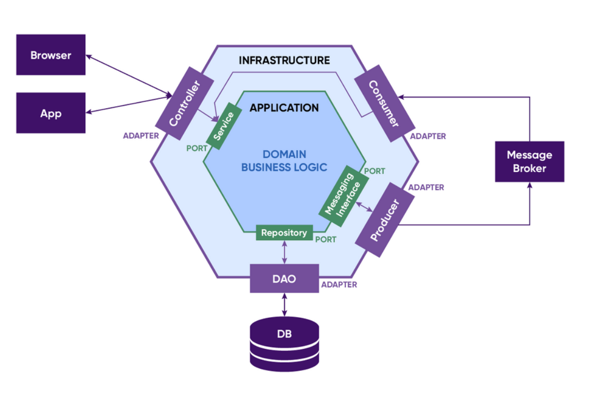
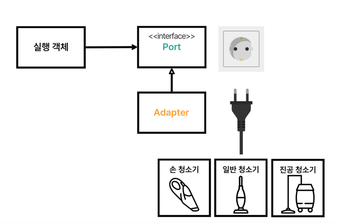
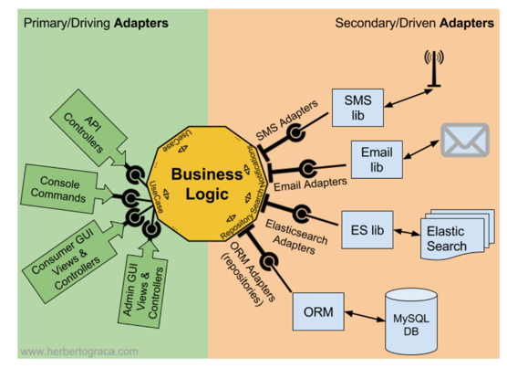
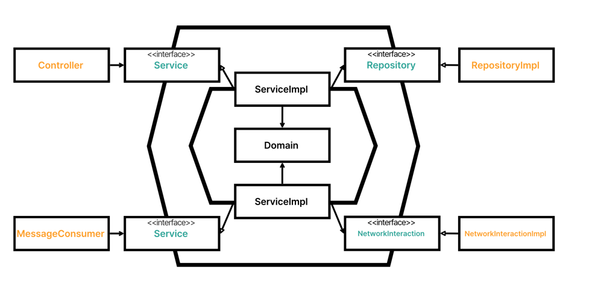
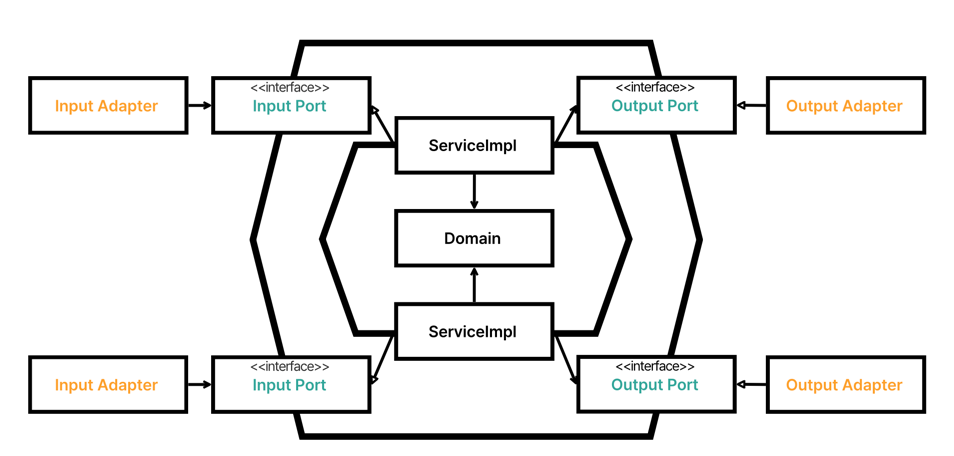

<h1>My Self</h1>

<h2> TDD</h2>

Test Driven Development (테스트 주도 개발)

작은 단위위 테스트 케이스를 작성하고 이를 통과하는 코드를 추가하는 단계를 반복하여 구현

RED 단계

실패하는 테스트 코드를 먼저 작성

GREEN 단계

테스트 코드를 성공시키기 위한 실제 코드를 작성

YELLOW 단계

중복 코드 제거, 일반화 등의 리팩토링 수행

실패하는 테스트 코드를 작성할 때까지 실제 코드를 작성하지 않는 것과,

실패하는 테스트를 통과할 정도의 실제 코드를 작성해야함

이를 통해 실제 코드에 대해 기대하는 바를 명확하게 정의함으로써 불필요한 설계를 피할 수 있고,

정확한 요구 사항에 집중할 수 있다

<h2> DDD</h2>

소프트웨어 코드의 구조와 언어를 비즈니스 도메인의 용어에 일치시켜 나간다는 뜻

Domain : 소프트웨어가 해결하고자 하는 문제 영역

DDD의 목표 : 애플리케이션 또는 그 안의 모듈 간의 의존성은 최소화하고, 응집성은 최대화 하는 것

<h2> 헥사고날 아키텍처</h2>

도메인 비즈니스 로직이 외부요소에 의존하지 않게 만들고, 프레젠테이션 계층과 데이터 소스 계층 같은 외부 요소들이 도메인 계층에 의존하도록 한다

외부와의 접촉을 인터페이스로 추상화하여 비즈니스 로직 안에 외부 코드나 로직의 주입을 막는 것, 외부 라이브러리 및 툴로부터 분리시키는 것이 아키텍처의 핵심

 포트-어뎁터 패턴

<h3> 장점</h3>

외부에서 도메인으로 향하는 방향이 단방향으로 유지됨

외부 세계는 관심 없다. 소프트웨어 도메인에 관심이 있다

테스트에 유리하다 

<h2> 소형 테스트</h2>

외부 의존성을 제거하여 테스트가 빠르게 실행될 수 있도록 작셩

도메인을 사용했을때 개발 가능

Repository를 추상화하여 FakeRepository를 작성 후 실제 서비스코드에서는 RepositoryImpl을, 테스트에서는 FakeRepository를 주입받아 사용할 수 있도록 함

mockito를 사용하지 않았음

<h2> 느낀 점</h2>

기능을 추가할 때 정말 막막했다.

하지만 맨 땅에 헤딩식으로 실패하는 테스트를 먼저 작성한 후 테스트가 성공하도록 서비스 코드를 작성하니 수월했다

오래걸리긴 했지만,, 확실히 확장성이 좋은 것 같다.

service, repository를 추상화하여 개발하니 스프링에서 제공해주는 IOC의 편리함을 더 잘 이해할 수 있었던 것 같고,

테스트에서 fakeRepository를 사용하여 테스트를 성공적으로 작성하고 나니 실제 서비스의 repositoryImpl은 JPA와 같은 프레임워크에 맞춰서 작성해주기만 하면 됐기 때문에 더 수월하게 할 수 있었다.

유지보수에 대해서도 생각해보아야겠다
