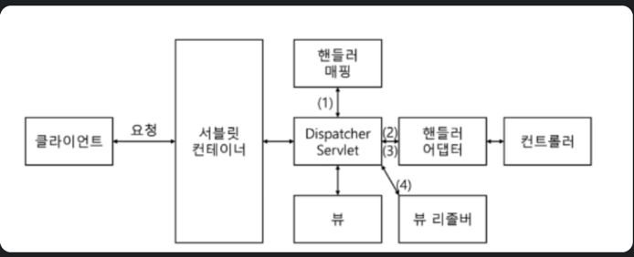

<h1> Web Shopping</h1>

<h2> Spring</h2>

<h3> IoC (Inversion of Control)</h3>
<ul>
    <li>객체의 생성과 관리를 스프링 프레임워크가 대신하도록 위임</li>
    <li>스프링 컨테이너에 Bean을 미리 등록하고, 필요한 곳에서 컨테이너에서 빈을 가져와 사용할 수 있게 됨</li>
    <li>이때, Bean을 가져올 때 의존성 주입(DI)방식을 사용하여 객체 간의 의존성을 자동으로 주입받을 수 있게 됨</li>
</ul>

<h3> DI (Dependency Injection)</h3>
<ul>
    <li>객체 간의 의존성을 줄이고 유지보수성을 높이기 위해 사용됨</li>
    <li>Bean으로 등록한 객체를 주입받아서 사용 가능함</li>
    <li>객체의 생명주기 관리를 스프링 컨테이너에게 위임하여 객체간의 결합도를 낮추고 유연한 구조를 유지할 수 있게 되어, 개발자는 비즈니스 로직에만 집중할 수 있게 됨</li>
</ul>

<h3> Spring Bean</h3>
<ul>
    <li>스프링 컨테이너에 의해 관리되는 객체</li>
    <li>객체 생성, 의존성 주입, 라이프사이클 관리 등을 스프링에 위임</li>
</ul>

<h3> Bean 생명 주기</h3>

스프링 IoC 컨테이너 생성 -> 스프링 Bean 생성 -> 의존성 주입 -> 초기화 콜백 메서드 호출 -> Bean 사용 -> 소멸 전 콜백 메서드 호출 -> 스프링 종료

<ul>
    <li>생명 주기 : 객체 생성 -> 의존 설정 -> 초기화 -> 사용 -> 소멸</li>
    <li>@PostConstruct로 초기화 / @PreDestory로 소멸</li>
</ul>

<h3> Bean Scope</h3>
<ul>
    <li>빈이 언제 생성되고, 언제 종료(소멸)되는지 -> 싱클톤 / 프로토타입 / Request / Session</li>
    <li>싱글톤이 기본으로 설정 -> 가장 긴 생명주기를 갖는 빈스코프</li>
    <li>프로토타입 -> 가장 짧은 생명주기를 갖는 빈 스코프, 호출 시 생성되고 스프링 컨테이너에서 관리하지 않음</li>
</ul>

<h3> Spring IoC Container</h3>
<ul>
    <li>Spring이 Bean으로 등록된 객체의 라이프사이클과 의존성을 관리해 주는 컨테이너</li>
</ul>

<h3> MVC</h3>

Model, View, Controller로 애플리케이션을 구성하는 컴포넌트의 역할을 크게 3가지로 구분한 것

<ul>
    <li>Model : 비즈니스 로직과 데이터를 담당</li>
    <li>View : 모델에서 처리된 데이터를 사용자에게 보여주는 역할</li>
    <li>Controller : 클라이언트와 소통을 담당. 클라이언트의 요청을 받아서 처리하고, 그 결과를 View에 전달하는 역할</li>
</ul>

<h3> 레이어드 아키텍쳐</h3>

애플리케이션을 구성하는 컴포넌트를 레이어(계층)으로 묶어서 구성한 구조

<ul>
    <li>프레젠테이션 계층, 비즈니스 계층, 데이터 접근 계층, 데이터베이스 계층</li>
    <li>핵심은 단방향 의존성이다. 하위 계층은 상위 계층을 몰라야한다. 하위 계층은 인터페이스만 제공하고 요청만 받을 뿐이다.</li>
</ul>

<h3> 레이어드 아키텍처와 MVC 패턴을 이용했을 때 장점</h3>
<ul>
    <li>각 레이어가 책임과 역할을 명확히 가지게 돼서 객체지향적으로 설계할 수 있다</li>
    <li>각 레이어의 계층을 나눠서 모듈화 할 수 있다</li>
    <li>각 레이어의 하위 모듈에만 의존하도록 하여 의존성을 최소화할 수 있다</li>
    <li>각 레이어의 역할이 명확하고 모듈화 되어 테스트가 용이하다</li>
    <li>각 레이어가 독립적으로 개발되기 때문에 재사용성과 확장성이 좋아진다</li>
</ul>

<h3> MVC 동작 구조</h3>

<ol>
    <li>클라이언트에게 요청 (HttpServletRequest)을 받는다</li>
    <li>DispatcherServlet은 HandlerMapping을 통해 Handler를 찾는다</li>
    <li>DispatcherServlet은 HandlerAdapter를 조회하고 실행한다</li>
    <li>HandlerAdapter는 Handler를 호출해서 요청을 처리한다</li>
    <li>처리된 데이터는 DispatcherSeervlet으로 반환된다</li>
</ol>

<strong>REST 방식인 경우</strong>

데이터를 MessageConverter를 통해 JSON 형식으로 변환하고, ResponseBody로 응답합니다.

<strong>REST 방식이 아닌 경우</strong>

View Resolver를 찾아서 실행하고, 이 ViewResolver는 View에 전달할 데이터를 추가하여 클라이언트에게 View를 반환합니다.

<h2> JPA</h2>
<h3> ORM</h3>
<ul>
    <li>Object Relation Mapping으로, 객체 관계 매핑을 의미함</li>
    <li>객체지향 언어에서 객치와 RDB의 테이블을 자동으로 매핑해주는 기술</li>
    <li>DB테이블을 객체처럼 다룰 수 있게 해 주어서, SQL문 대신 코드로 DB를 다룰 수 있게 도와줌</li>
</ul>

<h3> ORM 장점</h3>
<ul>
    <li>객체지향적으로 DB쿼리를 조작할 수 있고, SQL을 직접 작성하지 않아도 돼서 개발 비용이 줄어듬</li>
    <li>특정 DB에 대한 종속성이 줄어듬</li>
    <li>코드 가독성, 재사용성, 유지보수성이 좋아짐</li>
</ul>

<h3> ORM, JPA, Spring data JPA 차이</h3>

JPA는 자바 진영에서 표준으로 된 ORM이고, JPA는 인터페이스의 집합

즉, Java에서 사용하는 ORM 표준은 JPA

JPA의 대표적인 구현체 중 하나인 Hibernate를 개발자가 사용하기 쉽게 모듈화한 것이 Spring data JPA

<h3> 영속성 컨텍스트</h3>
<ul>
    <li>영속성 컨텍스트는 데이터를 영구 보관하는 환경이라는 뜻</li>
    <li>애플리케이션과 DB 사이에서 객체를 보관하는 가상 데이터베이스의 역할</li>
    <li>논리적인 개념으로, 눈에 보이지 않지만 EntityManager가 생성될 때 1대 1로 영속성 컨텍스트가 생성됨</li>
    <li>EntityManager를 통해 영속성 컨텍스트에 접근하여 데이터를 핸들링 할 수 있음</li>
</ul>

영속성 컨텍스트는 트랜잭션 단위로 동작함

트랜잭션이 시작될 때 EntityManager가 생성되고, 1대 1로 영속성 컨텍스트가 생성됨

트랜잭션이 커밋되면 EntityManager와 영속성 컨텍스트 모두 사라지게 됨

<h3> 영속성 컨텍스트 장점</h3>
<ol>
    <li>1차 캐시 (영속성 컨텍스트 내에 위치하여 캐시와 같은 역할을 수행함)
        <ul>
            <li>데이터를 SELECT할 때, 우선 1차 캐시에서 해당 데이터를 찾아봄</li>
            <li>만약 1차 캐시에 해당 데이터가 있으면 1차 캐시에 있는 데이터를 반환</li>
            <li>없으면 DB에서 직접 SELECT해와서, 1차캐시에 저장 후 1차캐시에 저장된 데이터를 반환</li>
        </ul>
    </li>
    <li>동일성 보장
        <ul>
            <li>1차캐시에 의해 엔티티는 영속성 컨텍스트에 관리되고, SELECT해올 때, 1차 캐시에서 데이터를 불러오게됨</li>
            <li>이 때문에, JPA로 같은 데이터를 두 번 조회하면 두 데이터는 주소까지 일치하게 되어 == 비교가 가능해짐</li>
        </ul>
    </li>
    <li>쓰기 지연
        <ul>
            <li>트랜잭션이 커밋되기 전까지 영속성 컨텍스트내에 위치한 쓰기 지연 SQL 저장소에 SQL 쿼리를 저장해 뒀다가 트랜잭션이 커밋되는 시점에 모든 SQL을 DB에 전달함</li>
        </ul>
    </li>
    <li>변경 감지
        <ul>
            <li>엔티티가 변경되면 따로 저장하거나, 수정하는 코드 또는 쿼리를 작성하지 않아도 자동으로 변경해줌</li>
            <li>처음 DB에서 데이터를 SELECT해서 1차 캐시에 데이터를 저장할 때 스냅샷을 저장해 뒀다가 커밋이 일어날 때 이 스냅샷과 비교하여 UPDATE 쿼리를 자동으로 생성해서 DB에 전달함</li>
        </ul>
    </li>
    <li>지연 로딩
        <ul>
            <li>연관관계가 있는 엔티티가 있을 때, 해당 엔티티를 실제 사용할 때 SELECT 쿼리를 날리는 기능</li>
            <li>연관관계의 주인인 Entity를 조회할 때 연관관계 Entity까지 동시에 불러오게 되는 즉시로딩과 대비되는 개념</li>
        </ul>
    </li>
</ol>

<h3> N+1문제</h3>
<ul>
    <li>연관 관계에서 발생하는 이슈로 연관 관계가 설정된 엔티티를 조회할 경우 조회된 데이터 갯수(n)만큼 연관관계의 조회 쿼리가 추가로 발생하여 데이터를 읽어오게됨</li>
    <li>조회 시 1개의 쿼리를 생각하고 설계를 했으나 나오지 않아도 되는 조회의 쿼리가 N개가 더 발생하는 문제</li>
</ul>

<h3> N+1문제 해결</h3>
<ul>
    <li>Fetch Join
        <ul>
            <li>조회의 주체가 되는 Entity 이외에 Fetch Join이 걸린 연관 Entity도 함께 SELECT 하여 모두 영속화</li>
        </ul>
    </li>
    <li>@Entity Graph
    </li>
</ul>
