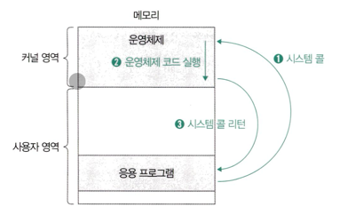

<h1>운영체제의 큰 그림</h1>

<h2 style="color: cornflowerblue"> 운영체제의 역할</h2>
<ol>
    <li>CPU 관리 : CPU 스케줄링</li>
    <li>메모리 관리 : 가상 메모리</li>
    <li>파일/디렉터리 관리 : 파일 시스템</li>
    <li>프로세스 및 스레드 관리</li>
</ol>

<h2 style="color: cornflowerblue;"> 시스템 콜과 이중 모드</h2>

운영체제는 메모리 내의 커널 영역에 따로 적재되어 실행됨

윤영체제가 적재되는 커널 영역 외에 사용자 응용 프로그램이 적재되는 공간은 사용자 영역

<h3> 시스템 콜</h3>

운영체제의 서비스를 제공 받기 위한 수단(인터페이스), 호출 가능한 함수의 형태를 가짐

응용 프로그램이 운영체제로 부터 어떤 기능을 제공받고자 한다면 다음과 같이 그 기능에 해당하는 시스템 콜을 호출하면 됨

<h4> 소프트웨어 인터럽트</h4>

운영체제에는 인터럽트를 발생시키는 특정 명령어가 있는데, 자원에 접근하는 입출력 명령어가 대표적이며, 이러한 명령어에 의해 발생하는 인터럽트를 의미함

<ol>
    <li>사용자 영역을 실행하는 과정에서 시스템 콜이 호출되면 여느 인터럽트와 마찬가지로 CPU는 현재 수행 중인 작업을 백업하고</li>
    <li>커널 영역 내의 인터럽트를 처리하기 위한 코드(시스템 콜을 구성하는 코드)를 실행한 뒤</li>
    <li>다시 사용자 영역의 코드 실행을 재개함</li>
</ol>

