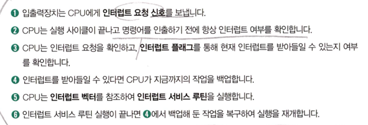

<h1>CPU</h1>

<h2 style="color: cornflowerblue"> 레지스터</h2>

레지스터는 CPU 안에 있는 작은 임시 저장장치

<ol>
    <li>프로그램 카운터 : 메모리에서 다음으로 읽어 들일 명령어의 주소 저장, 명령어 포인터라고도 함</li>
    <li>명령어 레지스터 : 해석할 명령어, 즉 메모리에서 방금 읽어 들인 명령어를 저장하는 레지스터</li>
    <li>범용 레지스터 : 일반적인 상황에서 자유롭게 사용할 수 있는 레지스터</li>
    <li>플래그 레지스터 : 연산의 결과 혹은 CPU 상태에 대한 부가 정보인 플래그값을 저장하는 레지스터  ex) 부호 플래그, 오버플로우 플래그 등등..</li>
    <li>스택 포인터 : 메모리 내 스택 영역의 최상단 스택 데이터 위치를 가리키는 레지스터</li>
</ol>

<h2 style="color: cornflowerblue"> 인터럽트</h2>

방해하다, 중단시키다 라는 의미

CPU가 수행 중인 작업은 방해를 받아 잠시 중단될 수 있는데, 이렇게 CPU의 작업을 방해하는 신호를 인터럽트라고 함

<h3>동기 인터럽트 ('예외' 라고 불림)</h3>

CPU에 의해 발생하는 인터럽트

CPU가 예외적인 상황을 마주쳤을 때 발생하는 인터럽트.

폴트 : 예외를 처리한 직후 예외가 발생한 명령어 부터 실행을 재개하는 예외

트랩 : 예외를 처리한 직후 예외가 발생한 명령어의 다음 명령어부터 실행을 재개하는 예외

중단 : CPU가 실행 중인 프로그램을 강제로 중단시킬 수밖에 없는 심각한 오류를 발견했을때 발생하는 예외

<h3> 비동기 인터럽트</h3>

주로 입출력장치에 의해 발생하는 인터럽트

CPU는 폴딩 방식을 사용함

CPU가 인터럽트를 처리한다는 것 : 인터럽트 서비스 루틴을 실행하고, 본래 수행하던 작업으로 다시 돌아온다는 것

인터럽트 서비스 루틴 : 인터럽트를 처리하기 위한 프로그램, 인터럽트 핸들러 라고 불림

어떤 인터럽트가 발생했을 때 해당 인터럽트를 어떻게 처리하고 작동해야 할지에 대한 정보로 이루어진 프로그램

<h2 style="color: cornflowerblue"> CPU 성능 향상 위해,,</h2>
<h3>CPU 클럭 속도 향상</h3>
<h3>멀티 코어, 멀티 스레드</h3>

멀티 코어 : 하나의 CPU안에 여러개의 코어를,,

멀티 스레드 : 하나의 코어 안에 여러개의 스레드를,,,

병렬성 : 작업을 물리적으로 동시에 처리하는 성질, '명령어 파이프라이닝'

동시성 : 동시에 작업을 처리하는 것처럼 보이는 성질
